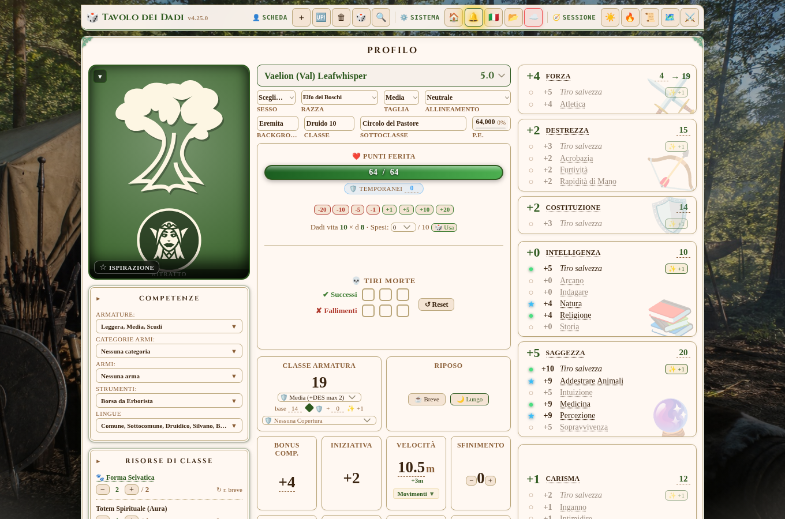
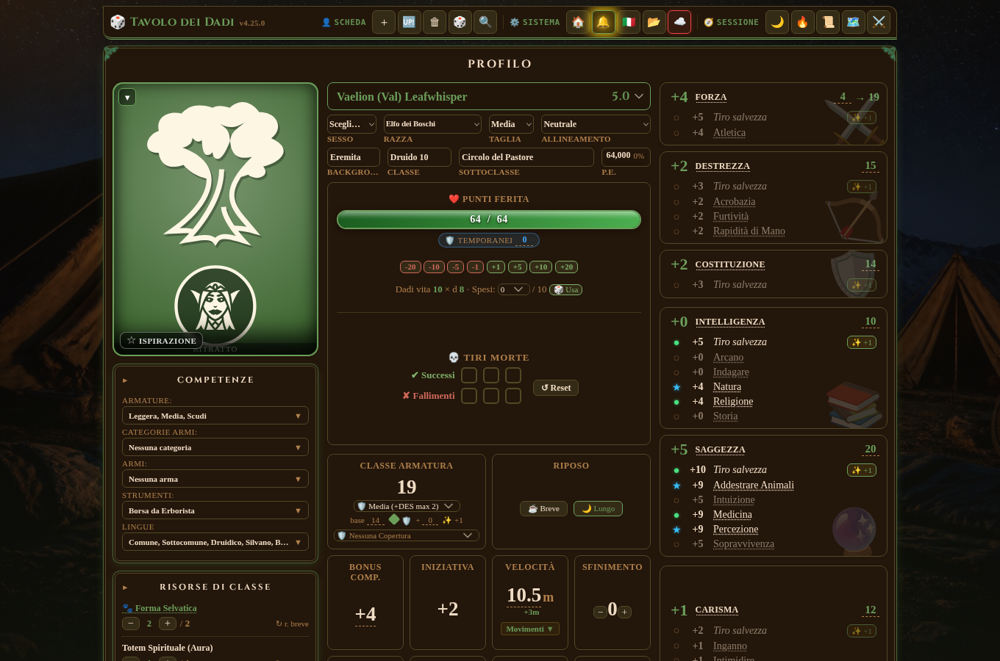

# 🎲 Tavolo dei Dadi

[](LICENSE.md)
[](https://github.com/samuelenigro97-prog/tavolo-dei-dadi/actions/workflows/deploy.yml)
[](https://github.com/samuelenigro97-prog/tavolo-dei-dadi/releases)

Scheda del personaggio D&D 5e interattiva con tiratore di dadi integrato, nel
formato della scheda ufficiale 2024, tema "vecchio manuale" (chiaro o scuro).
Provala online: <https://samuelenigro97-prog.github.io/tavolo-dei-dadi/>.

La scheda È l'interfaccia: **1 click modifica un valore, tieni premuto (o
doppio click/tap) tira il dado**.

<p>
  
  
</p>

## Cosa fa

- Tutti i tiri 5e: prove di caratteristica, tiri salvezza, 18 abilità (con
  competenza e maestria), iniziativa, attacchi e danni con dettaglio dei dadi
  (sul critico i dadi raddoppiano, il modificatore no), attacco con
  incantesimo (con CD calcolata), dadi vita, TS contro morte.
- Selettore Normale / Vantaggio / Svantaggio valido per ogni tiro di d20.
- Dado libero (d4–d100) ed espressioni a piacere tipo `3d6+2`.
- Sezioni complete: incantesimi (slot cliccabili, trucchetti separati,
  preparati in evidenza), privilegi e tratti, talenti, equipaggiamento con
  contenitori/effetti/sintonia, risorse di classe, poteri homebrew,
  Trasformazioni (Forma Selvatica/Metamorfosi con catalogo di creature),
  combat tracker, diario di sessione, lingue, denari, note.
- Regole 2014 e 2024 selezionabili (`5.0`/`5.5`), incluso lo sfinimento.
- Temi grafici multipli ("Luoghi": Taverna, Mare, Montagna...) con audio
  d'ambiente opzionale, oltre al chiaro/scuro automatico giorno/notte.
- **Più personaggi**: selettore in alto con Nuovo / Duplica / Elimina; ogni
  PG si salva da solo in `localStorage`. Quattro personaggi d'esempio già
  pronti al primo avvio.
- Import automatico della scheda da PDF (via un Worker Cloudflare che usa
  l'API Anthropic) oppure Esporta/Importa JSON per portare una scheda su un
  altro dispositivo.
- Condivisione di una scheda in sola lettura tramite codice stanza.
- PWA installabile: dopo la prima visita funziona anche offline (tranne
  l'import da PDF, che richiede la rete).
- Ottimizzata per desktop e mobile touch.

## Avvio

```bash
npm install
npm run dev
```

L'app è su <http://localhost:5173>. Non serve nessuna chiave/API per usarla:
l'unica funzione che richiede rete è l'import automatico da PDF, che punta a
un endpoint esterno (Worker Cloudflare) configurabile da menu o da
`VITE_TRANSCRIBE_URL` — senza configurarlo, tutto il resto funziona lo stesso
(si può sempre importare/esportare JSON).

## Test

```bash
npm test          # unitari (Node test runner)
npm run test:e2e  # end-to-end (Playwright, un file per sezione della scheda)
npm run lint       # ESLint
```

## Stack

React 18 + Vite per il frontend, **niente backend locale**: la UI vive
soprattutto in `src/App.jsx`, con una parte crescente di moduli estratti in
`src/ui/`, `src/rules/`, `src/data/`, `src/dati/` e `src/utils/`.

Per le convenzioni di sviluppo, la struttura dei moduli e le regole di
dominio D&D vedi [CLAUDE.md](./CLAUDE.md); per lo stato dei lavori e la
roadmap vedi [docs/BACKLOG.md](./docs/BACKLOG.md).
